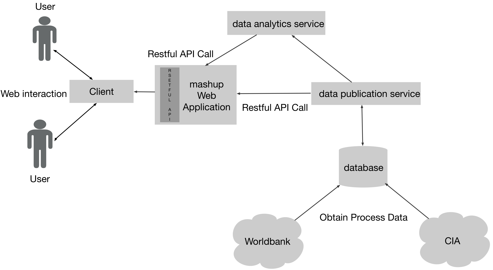

# Junipy

**J**unipy **u**niversal **n**ational **i**ndicator **p**arse and anal**y**se service

## Important Links

- [Junipy demo website](http://junipy.jackj.me/)
- [Junipy trello board](https://trello.com/b/BLktTIOc/junipy)
- [Assignment 3: Design and Development of a Data Mashup Application](https://webcms3.cse.unsw.edu.au/COMP9321/18s1/resources/16378)

## Team members

- [Jack](https://webcms3.cse.unsw.edu.au/users/z5129432): database(obtain data, create database, database query function)
- [Joanna](https://webcms3.cse.unsw.edu.au/users/z5172461): Mashup web application(RESTful API)
- [Hao](https://webcms3.cse.unsw.edu.au/users/z5102511): Client
- [Helen Paik](https://webcms3.cse.unsw.edu.au/users/z2181240): Tutor
- [Sean](https://webcms3.cse.unsw.edu.au/users/z5090071): Data Analytics Service

## System Design

